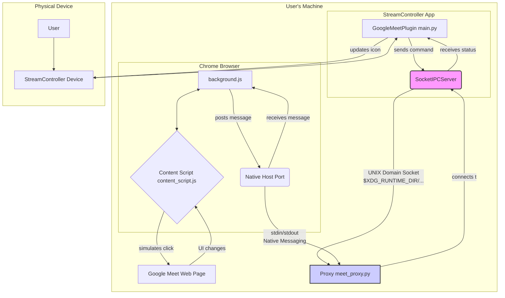

# Development Notes

The following diagram illustrates the architecture of the Google Meet plugin and its interaction with the StreamController, Chrome extension, and Google Meet.

## Architecture Overview

The system is composed of four main components:

1.  **StreamController Device**: The physical hardware device that the user interacts with.
2.  **StreamController App**: The desktop application that runs on the user's machine and manages plugins.
3.  **GoogleMeetPlugin**: The Python plugin that runs within the StreamController App.
4.  **Chrome Extension**: A companion extension that runs in the user's Chrome browser and interacts with the Google Meet web page.

## Communication Flow

The communication between these components is as follows:

1.  The user presses a button on the **StreamController Device**.
2.  The **StreamController App** receives the button press event and forwards it to the **GoogleMeetPlugin**.
3.  The **GoogleMeetPlugin** sends a command to the **Chrome Extension** via a native messaging proxy.
4.  The **Chrome Extension** receives the command and simulates a click on the corresponding button on the **Google Meet Web Page**.
5.  The **Chrome Extension** observes changes in the Google Meet UI and sends status updates back to the **GoogleMeetPlugin** via the native messaging proxy.
6.  The **GoogleMeetPlugin** receives the status update and updates the icon on the **StreamController Device** to reflect the new state.

## Native Messaging

Native messaging is a mechanism that allows a Chrome extension to communicate with a native application running on the user's machine. In this project, the **Chrome Extension** communicates with the **GoogleMeetPlugin** via a Python script that acts as a proxy.

The proxy script is responsible for the following:

*   Reading messages from the Chrome extension via `stdin`.
*   Forwarding messages to the **GoogleMeetPlugin** via a UNIX domain socket.
*   Reading messages from the **GoogleMeetPlugin** via the UNIX domain socket.
*   Forwarding messages to the Chrome extension via `stdout`.

## Plugin Action Lifecycle

The plugin's actions are managed by the **StreamController App**. When the plugin is loaded, it registers all its actions with the app. Each action has a unique ID and a corresponding class that implements the action's logic.

When a user presses a button on the StreamController, the app calls the `on_key_down` method of the corresponding action. The action then sends a command to the Chrome extension to perform the desired action.

When the plugin receives a status update from the Chrome extension, it finds the relevant action and calls its `update_state` method. The action then updates its icon on the StreamController to reflect the new state.
