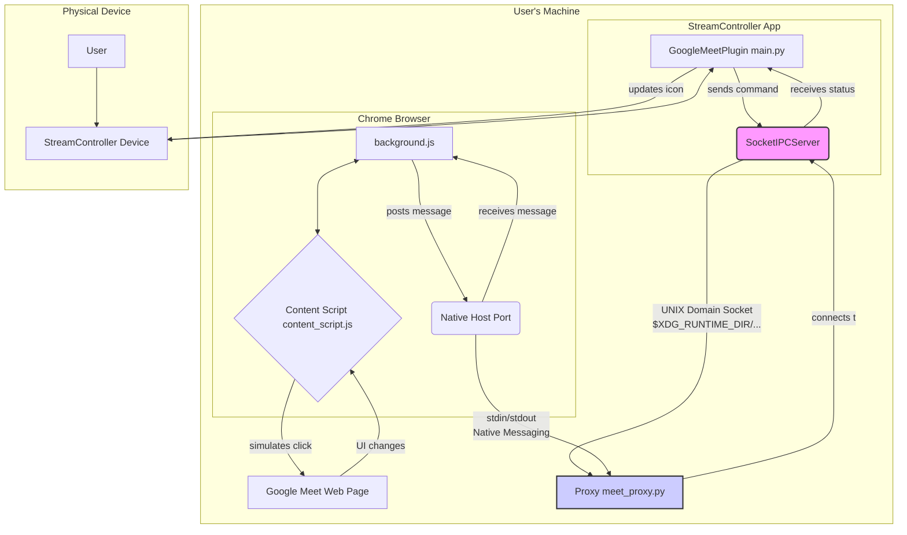

# Development Notes

```mermaid
graph TD
    subgraph User's Machine
        subgraph StreamController App
            A[GoogleMeetPlugin main.py] --sends command--> B(SocketIPCServer);
            B --receives status--> A;
        end

        subgraph Chrome Browser
            F[background.js] --posts message--> G(Native Host Port);
            G --receives message--> F;
            F <--> H{Content Script content_script.js};
        end

        I[Google Meet Web Page] --UI changes--> H;
        H --simulates click--> I;

        D[Proxy meet_proxy.py] --connects to--> B;
        B --UNIX Domain Socket<br>$XDG_RUNTIME_DIR/...--> D;

        G --stdin/stdout<br>Native Messaging--> D;
    end

    subgraph Physical Device
        U[User] --> S[StreamController Device];
    end

    S --> A;
    A --updates icon--> S;

    style B fill:#f9f,stroke:#333,stroke-width:2px
    style D fill:#ccf,stroke:#333,stroke-width:2px

```
